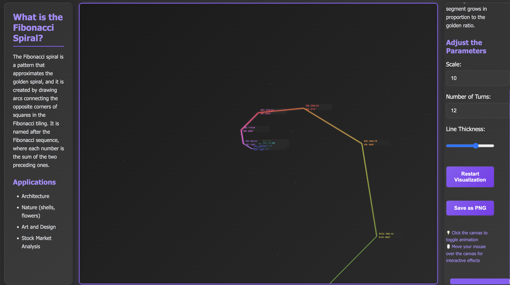

# Fibonacci Spiral Visualization

An interactive, dynamic Fibonacci spiral visualization built with HTML5 Canvas and JavaScript. Features stunning visual effects, real-time animations, and responsive design with a modern dark theme.

## ✨ Features

### 🎨 Dynamic Visual Effects
- **Animated Color Transitions**: Each spiral segment cycles through dynamic HSL colors that shift over time
- **Gradient Lines**: Beautiful gradients applied to each segment with smooth color transitions
- **Glow Effects**: Dynamic shadows and blur effects that pulse with the animation
- **Variable Line Thickness**: Lines dynamically adjust thickness based on time and segment position

### 🎮 Interactive Elements
- **Mouse Hover Effects**: Ripple effects that follow your cursor across the canvas
- **Click to Toggle**: Click anywhere on the canvas to start/stop continuous animation
- **Real-time Responsiveness**: All effects respond instantly to user interaction

### 🌟 Background Effects
- **Particle System**: 50 floating particles that move and pulse in the background
- **Animated Particles**: Particles wrap around the screen with pulsing alpha effects

### 📊 Enhanced Mathematical Display
- **Styled Annotations**: Mathematical properties displayed with semi-transparent backgrounds
- **Dynamic Text Colors**: Text colors match the corresponding spiral segment colors
- **Shadow Effects**: Subtle text shadows for improved readability

### 🎛️ User Controls
- **Scale**: Adjusts the size of the initial spiral segment
- **Number of Turns**: Controls how many segments the spiral contains
- **Line Thickness**: Dynamically adjusts the thickness of spiral lines
- **Save as PNG**: Export your visualization as a high-quality image

## 🛠️ Technologies

- **HTML5 Canvas**: High-performance 2D rendering
- **Modern CSS3**: Responsive design with dark theme and purple accents
- **Vanilla JavaScript**: Canvas manipulation, animations, and user interactions
- **Node.js & Express**: Local development server

## 🚀 Getting Started

### Prerequisites
- Node.js (v14 or higher)
- Modern web browser with HTML5 Canvas support

### Installation & Running

#### Node.js Server (Recommended)
```bash
# Clone the repository
git clone https://github.com/your-username/fibonacci-spiral-visualization.git

# Navigate to project directory
cd fibonacci-spiral-visualization

# Install dependencies
npm install

# Start the development server
npm start
```

Then visit `http://localhost:3000` in your browser.

#### Development Mode
```bash
# Start with auto-restart on file changes
npm run dev
```

#### Direct Browser Access
Simply open `index.html` in your browser - no server required.

#### Docker Deployment
```bash
# Build and run with Docker
docker build -t fibonacci-spiral .
docker run -p 8080:80 fibonacci-spiral
```

## 🎯 Usage

### Basic Controls
- **Adjust Parameters**: Use the right panel controls to modify scale, turns, and thickness
- **Interactive Canvas**: Click to toggle animation, move mouse for ripple effects
- **Save Image**: Click "Save as PNG" to download your current visualization

### Interactive Features
- 💡 **Click the canvas** to toggle continuous animation
- 🖱️ **Move your mouse** over the canvas for interactive ripple effects
- 🎨 **Watch the colors** cycle through the spectrum automatically
- ✨ **Observe the particles** floating and pulsing in the background

## 🎨 Visual Features

The visualization includes:
- **Dynamic color cycling** through the HSL spectrum
- **Smooth gradient transitions** between spiral segments
- **Pulsing glow effects** with variable intensity
- **Interactive mouse ripples** that follow cursor movement
- **Animated background particles** with wrapping physics
- **Responsive mathematical annotations** with styling

## 📱 Responsive Design

- **Desktop**: Full three-panel layout with optimal canvas size
- **Tablet**: Stacked layout with collapsible panels
- **Mobile**: Compact vertical layout with touch-friendly controls

## 🎯 Example

The visualization creates a mesmerizing, ever-changing display of the Fibonacci spiral with:
- Mathematical accuracy based on the golden ratio (φ ≈ 1.618)
- Real-time color transitions and effects
- Interactive elements that respond to user input
- Smooth 60fps animations



## 🔧 Technical Details

- **Canvas Resolution**: Automatically adjusts for high-DPI displays
- **Animation Loop**: Uses `requestAnimationFrame` for smooth 60fps rendering
- **Color System**: HSL-based dynamic color generation
- **Particle Physics**: Simple velocity-based particle movement with screen wrapping
- **Gradient Rendering**: Linear gradients applied per spiral segment

## 📄 License

This project is licensed under the MIT License. See the [LICENSE](LICENSE.md) file for details.

## 🤝 Contributing

1. Fork the repository
2. Create a feature branch (`git checkout -b feature/amazing-feature`)
3. Commit your changes (`git commit -m 'Add amazing feature'`)
4. Push to the branch (`git push origin feature/amazing-feature`)
5. Open a Pull Request

## 🙏 Acknowledgments

- The Fibonacci sequence and golden ratio for mathematical inspiration
- HTML5 Canvas API for powerful 2D rendering capabilities
- The mathematical beauty found in nature's spiral patterns
